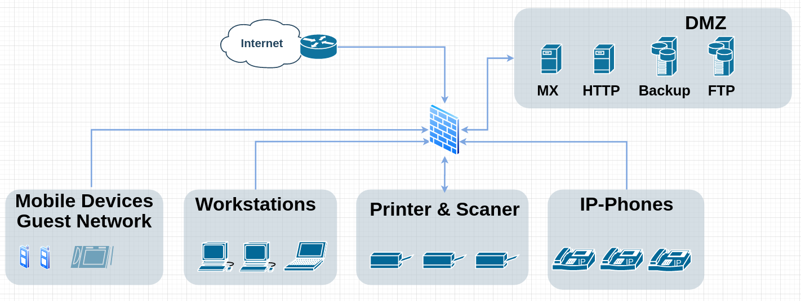

# Abgabe1 

## Beschreibung

Ein typisches KMU mit folgenden Anforderungen:

- Mailserver (SMTP von/zu Internet)
- Webserver (HTTP / HTTPS aus dem Internet, internem LAN)
- Interne User (Internet surfen, FTP, Mail)

## Netzwerkdiagram

Das Netzwerkdiagram ergibt sich wie folgt:

## Firewall Regeln

Fuer die Firewall REgeln wird davon ausgegangen, dass die Firewall Servicegruppierungen unterstuezt. Gemeint ist hier, dass es zum Beispiel einen Service "Web" gibt hinter dem die Ports 80 & 443 stehen oder einen Service Mail mit dem SMTP Port 25. 

Weiters sind auf der Firewall Netzwerksegmente fuer die einzelnen Subnetze wie als auch fuer zum Beispiel das Internet (alles ausser Interne IP-Ranges) definiert.

Scanner speichern Ihre Scans automatisch auf einem eigens dafuer zur verfuegung gestellten FTP-Server mit Personalisierten Ordnern von dem aus die Mitarbeiter die Kopien mittels ihrem Windows Konto (AD integration) jeweils ihre eigenen Files herunter laden koennen. Der Print-FTP Server wird jeden Tag um 03:00 morgends geleert.

### Outgoing
|name|source|destination|drop/allow|service|
|---|---|---|---|---|
|Guest/Mobile|GuestWLAN|WAN|allow|Web|
|Wokrstations|BueroLAN|Internet Printer DMZ|allow|Web Print FTP Mail|
|Printer&Scanner|PrintLAN|Print-FTP|allow|FTP|
|IP-Phones|VoIPLAN|BueroLAN Internet|allow|VoiP|
|OffsiteBackup|Backup|OffsiteBackupServer|allow|SSH|
|clean Up|any|any|deny|all|

### Incoming

|name|source|destination|drop/allow|service|
|---|---|---|---|---|
|WAN|Internet|MX|allow|SMTP|
|WAN|Internet|HTTP|allow|Web|
|clean Up|any|any|deny|all|
