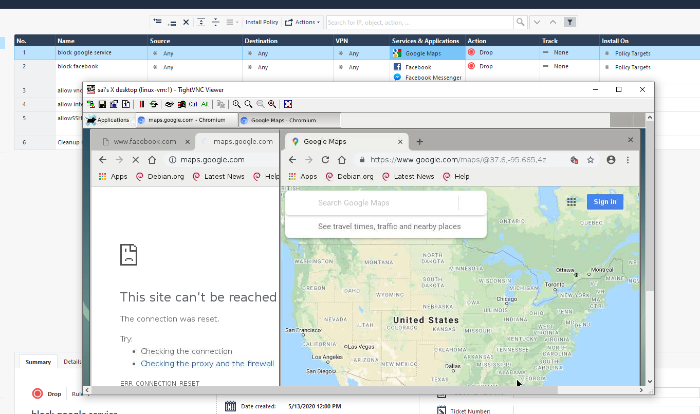

# Project G-Cloud Setup

|Name|value
|---|---|
| Project | SAWFT |
| Project ID | sawft-275017 |
| | |
|Cloudguard Admin User|admin|
|Cloudguard Admin PW|MesvQPH5h95c|
|Cloudguard internalIP(default)|10.128.0.2|
|Cloudguard internalIP(my-vpc)|192.168.23.2|
|Cloudguard externalIP|34.71.14.71|

# Lab 1.1: Connecting to Management

Um via Gaia Interface eine Verbindung aufbauen zu koennen war eine zusaetzliche Firewall Regel notwendig, welche den Traffic zur Firewall frei gibt.

Fingerprint der Cloudguard:

	THIN LEAD AWN LYE MAST MOLE ROUT AUK ARGO GALT CAL BLEW

Der Fingerprint dient zur Identifikation der verbundenen Appliance. Jedes device hat im Normalfall einen eigenen Fingerprint. So kann ein Vergleich zwar keinen Man-In-The-Middle-Angriff nicht verhindern aber erkennen.
Im einfachen Falle kann so auch einfach  ueberprueft werden ob man sich mit der gewuenschten Appliance verbunden hat.

# Lab 1.2: SSH Connection to Linux Instance

Angelegte Regeln mit den verwendeten Objekten.

Erfolgreiche Verbindung via SSH und Key-Authentication zur Linux VM

# Lab 1.3: VNCServer & NAT Rules

- Regel erstellt um von LinuxVM ins internet zugreifen zu koennen.
- Schritte aus Labanweisung durchgefuerht.
- NAT Regel Inbound von Port 3332 auf LinuxVM:5901. Es werden 2 Serviceobjekte fuer die NAT-Regel benoetigt.
- Security Policy welche den VNC custom Port (Service Objekt) Inbound auf die LinuxVM erlaubt

# Fragen 1: Application Control & URL Filtering

Fallstrick: Es muss noch das Applicationfiltering in den Policies Enabled werden um die Liste mit den Services auswaehlen zu koennen.

Die Applikation Security Policy wirkt bei HTTP aber nicht bei HTTPS.

