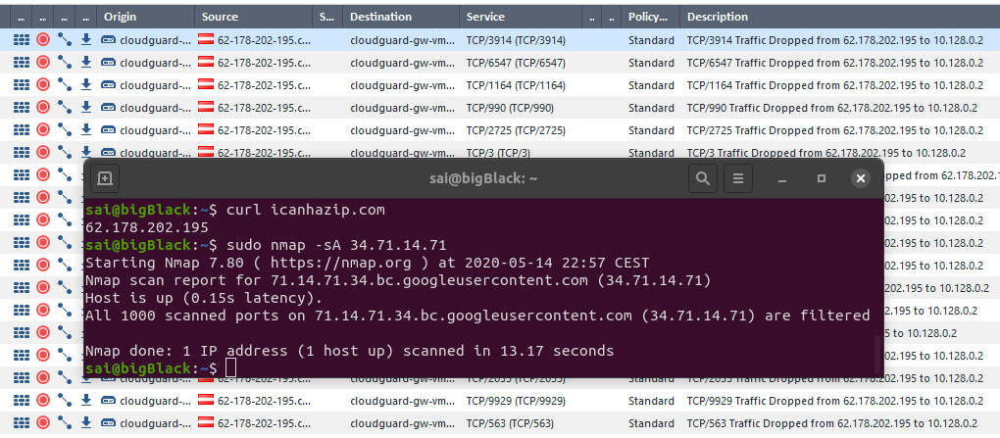
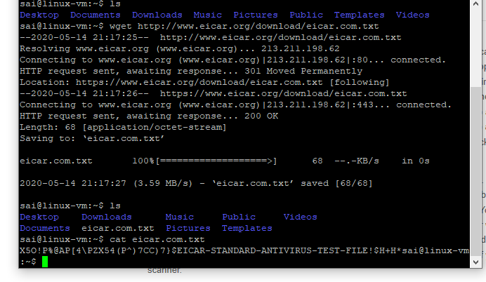

# Project G-Cloud Setup

|Name|value
|---|---|
| Project | SAWFT |
| Project ID | sawft-275017 |
| | |
|Cloudguard Admin User|admin|
|Cloudguard Admin PW|MesvQPH5h95c|
|Cloudguard internalIP(default)|10.128.0.2|
|Cloudguard internalIP(my-vpc)|192.168.23.2|
|Cloudguard externalIP|34.71.14.71|

Eine Schwierigkeit hierbei ist, dass die SmartConsole regelmaessig nicht mehr reagiert und somit die Applikation neu gestartet werden muss. Weiters hat der VNC-Zugang den Neustart nicht ueberlebt und musste manuell, nach einem Troubleshooting, eingerichtet werden.

# Lab 2.1: IPS

Der nmap Befehl zum erzeugen des Netzwerkverkehrs ist mit -sA also einem TCP ACK scan. Dieser geht relativ schnell.

# Lab 2.2: Anti-Virus

Da jeder Antivirus den EICAR-Teststring erkennen muss, ist die Vorgehensweise zu versuchen eine solche Datei via wget herunter zu laden. Dies war erfolgreich und wurde durch das Anti-Virus blade nicht gestoppt.

Auch Mimikatz konnte problemlos heruntergeladen werden.

Es gibt das Problem, dass beim herunterladen auf TLS gestellt wird und deswegen kann die Firewall das Paket nicht untersuchen.
Dies konnte leider auch mit http nicht geloest werden.

# Lab 2.3: HTTPS Inspection

Der Unterschied, bei SSL inspection ist, dass hier auch SSL Pakete untersucht und im Zweifellsfall gedropped werden. Nach dem Installieren des Certifikats merkt man als Client keinen Unterschied mehr. 
Ohne TLS inspection sieht die Firewall nur die Metadaten.