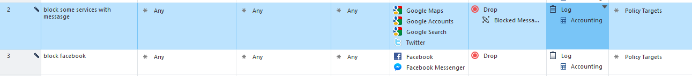
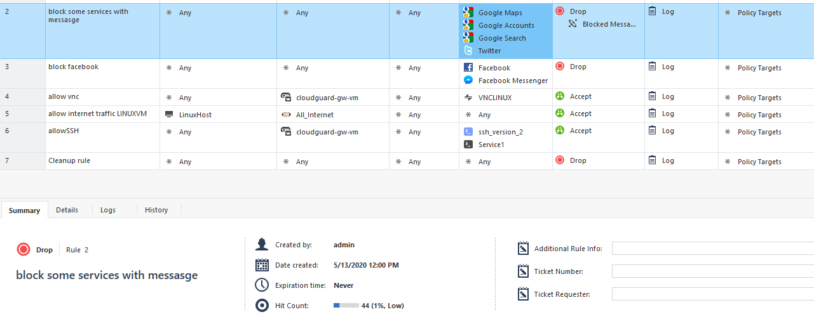
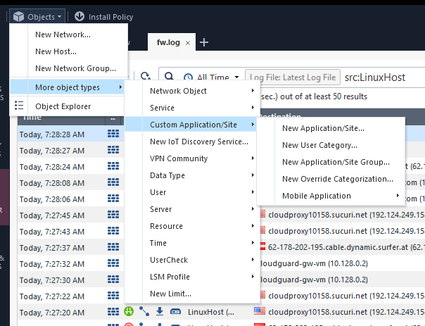
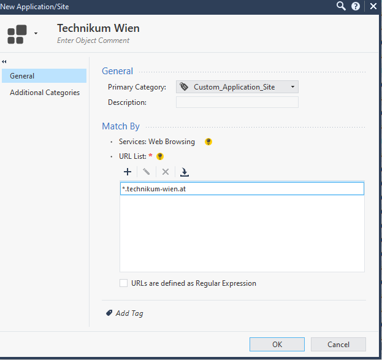
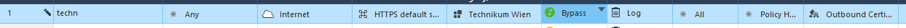
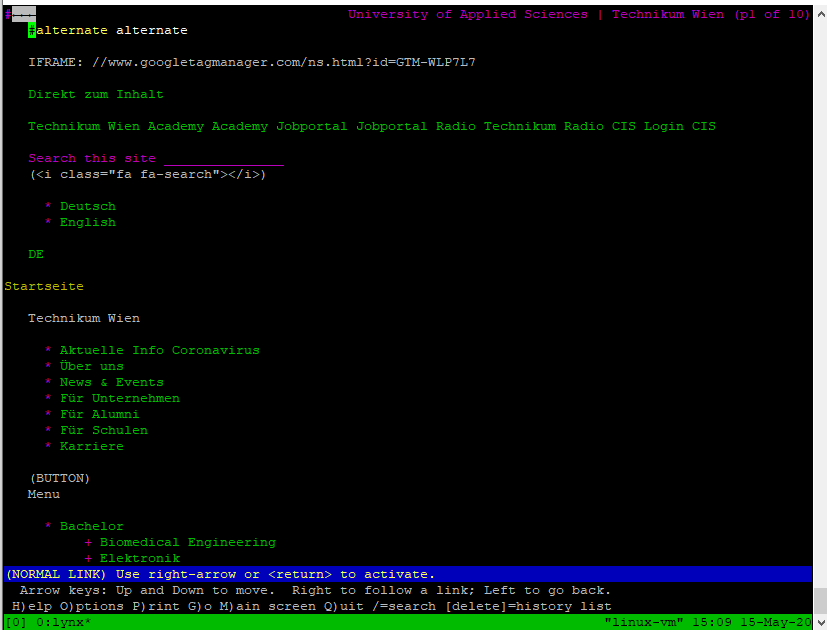

# Project G-Cloud Setup

|Name|value
|---|---|
| Project | SAWFT |
| Project ID | sawft-275017 |
| | |
|Cloudguard Admin User|admin|
|Cloudguard Admin PW|MesvQPH5h95c|
|Cloudguard internalIP(default)|10.128.0.2|
|Cloudguard internalIP(my-vpc)|192.168.23.2|
|Cloudguard externalIP|34.71.14.71|

# Lab 3.1: Application Control

Ein Hindernis bei dieser Uebung war, dass das Update fuer "Application Control & URL Filtering" sehr lange gebraucht hat.

Folgende Regeln wurden angelegt:

Die "block facebook"-Regel wurde zur Kontrolle angelegt um auch eine Seite geblockt zu haben , ohne Block Message.

Sonstige Vorgehensweise laut Anweisung.

Die Tests wurden im Lynx-Terminal Browser durchgefuehrt da es durchwegs Probleme mit VNC gab.

Dass die Services als geblockt markiert wurden zeigt der HitCount der Regel:

Mit HTTPS-Inspection werden die Seiten wie gewuenscht geblockt. Ohne HTTPS-Inspection werden die Seiten angezeigt, im Log wird jedoch ein "drop" hinterlegt.
Ohne HTTPS-Inspection ist das Blockieren von Webseiten nicht zuverlaesslich moeglich.

# 3.2: URL Filtering

Unter Objects

wurde folgendes Obejkt erstellt

Man kann nicht sagen, dass man gewisse Kategorien generell blocken wuerde. Es kommt immer auf das Unternehmen und den Wirtschaftszweig in dem man sich befindet. Beispielsweise wuerde ich bei einem Unternehmen wie der Novomatic "Gambling" nicht verbieten aber "Fashion" schon. Umgekehrt waere das bei einem Konzern wie H&M.

Bei einem Antivirus/Antispam Hersteller wie der Ikarus war nichts dergleichen geblockt um den Mitarbeitern ihre Arbeit zu ermoeglichen.

In einem "normalen" Umfeld wuerde ich auf jedenfall alle Kategorien in Betracht ziehen und dann diese freigeben welche in das Geschaeftsfeld des Unternehmens passt. Folgende Auflistung wird jedoch fast immer geblockt:

- Alcohol &Tobacco
- Anonymizer
- Hate /Rascism
- Illegal
- Pornography
- Sex
- Spam
- Spyware
- URL Filtering
- Violence

# 3.3 HTTPS Inspeciton Bypass

Es wurde folgende Bypass Policy erstellt:

Mit dieser Policy kann die Technikumseite wieder aufgerufen werden:

Leider kann mit diesem Browser das Zertifikat nicht angezeigt werden. Es wuerde jedoch das Technikum eigene Zertifikat angezeigt und nicht mehr das Proxyzertifikat der Firewall.

Ausnehmen wuerde ich externe essentielle Services, besonders wenn diese mit Certificate Pinning arbeiten. Das sind Zum Beispiel Security Systeme (AntiVirus, EDR, ...) oder Mirosoft Services wie Sharepoint oder Office364 zusaetzlich zu Cloudsystemen wie AWS, G-Cloud und Azure.
