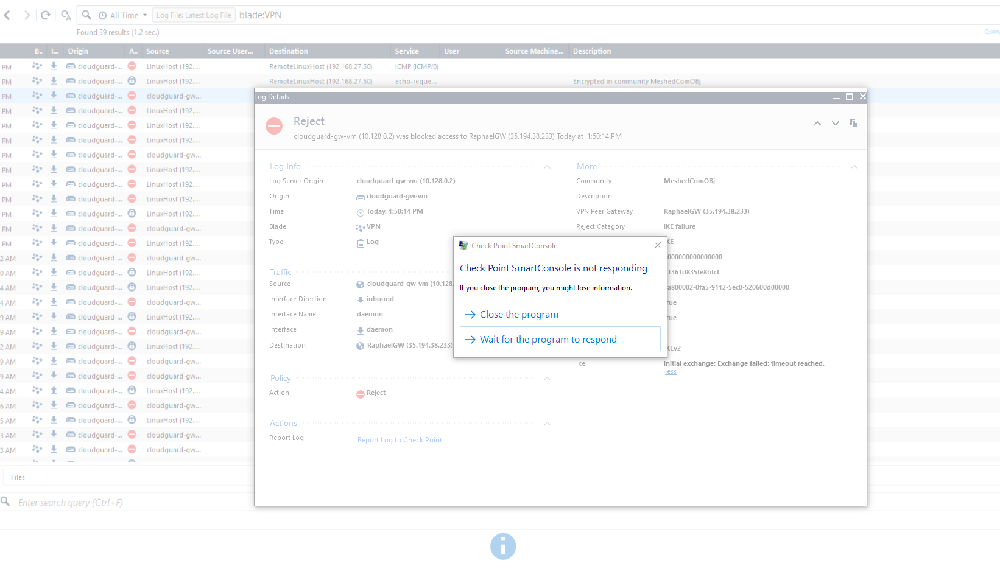
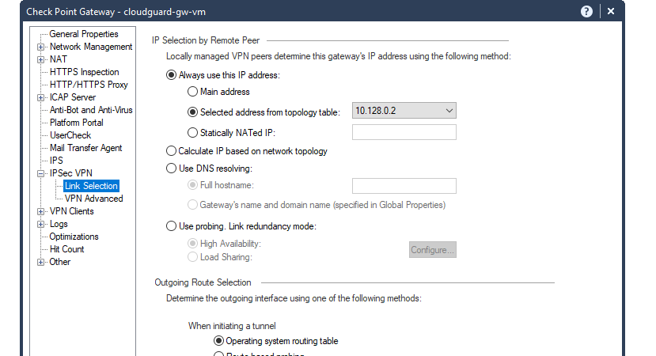
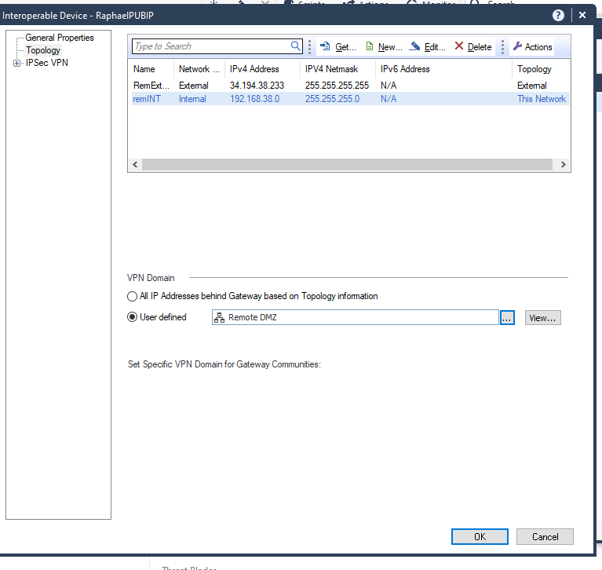
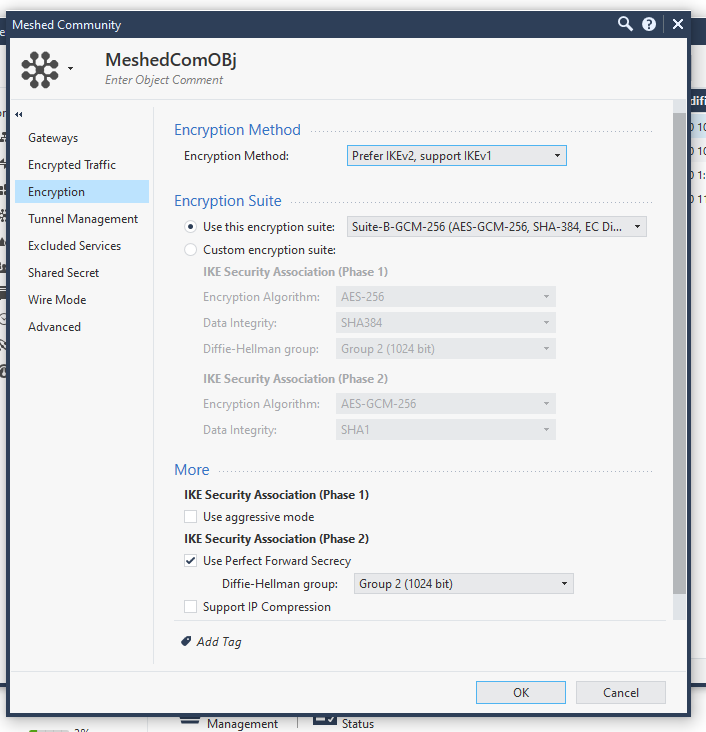
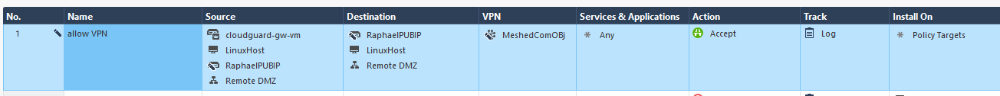
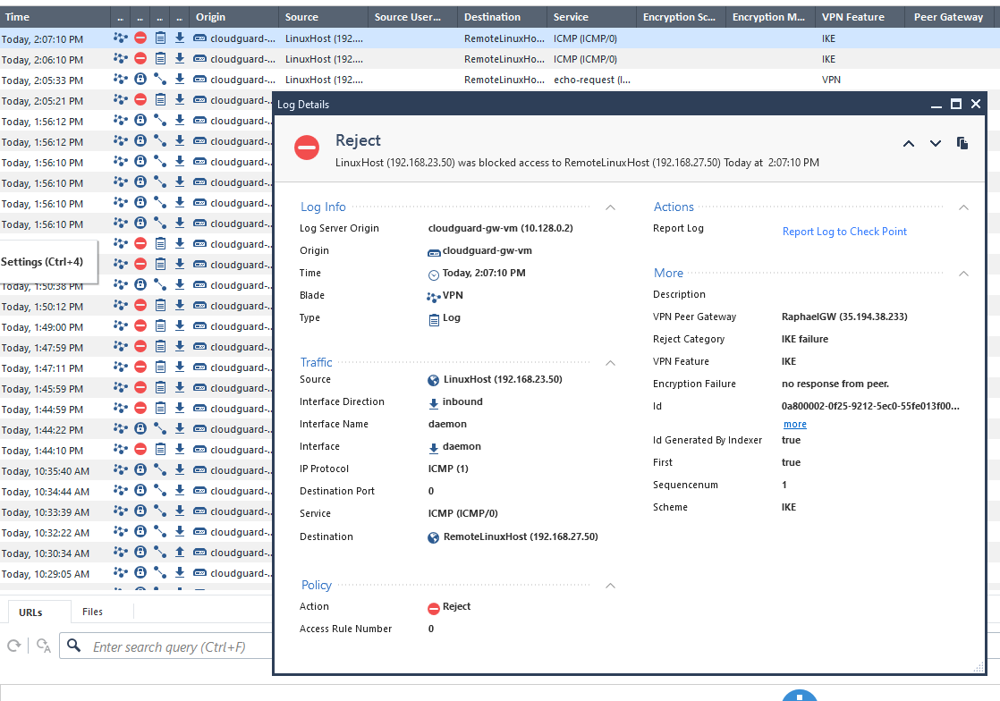
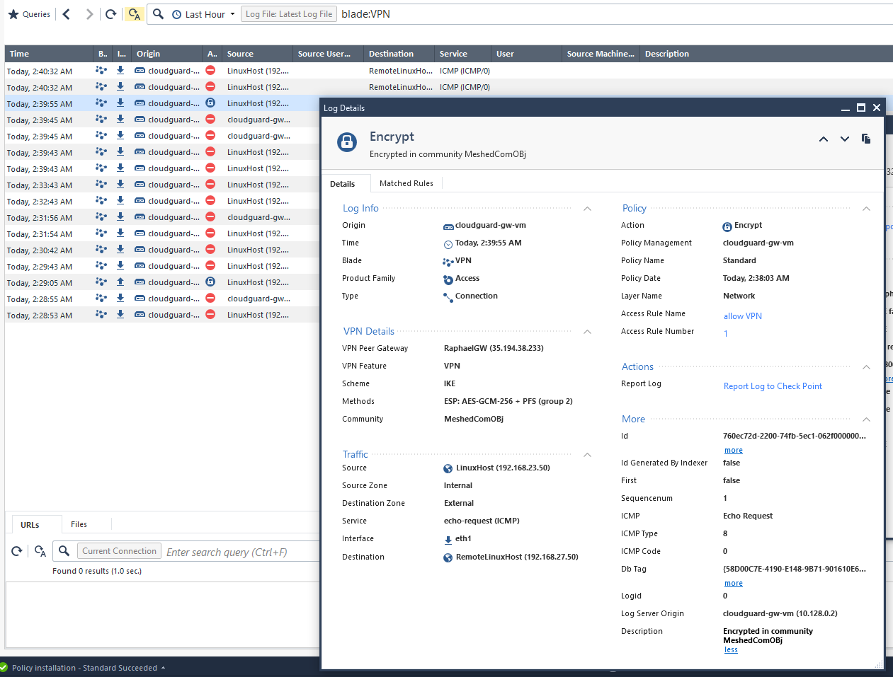

# Project G-Cloud Setup

|Name|value
|---|---|
| Project | SAWFT |
| Project ID | sawft-275017 |
| | |
|Cloudguard Admin User|admin|
|Cloudguard Admin PW|MesvQPH5h95c|
|Cloudguard internal IP(default)|10.128.0.2|
|Cloudguard internal IP(my-vpc)|192.168.23.2|
|Cloudguard external IP|34.71.14.71|
|LinuxHost IP| 192.168.23.50|
|||
|CLoudguard external IP Remote|35.194.38.233|
|LinuxHost IP Remote| 192.168.27.50|

# Lab 4: IPSec VPN

Eine Schwierigkeit, welche immer wieder auftauchte, war dass der RemoteClient regelmaessig haengen bleibt, und auch ab und zu abstuerzt.

## Aufbau/Vorgangsweise

Im Prinzip ist die Vorgangsweise in der Angabe erklaert, alleine die "externe" IP des Partners als Gateway muss die "echte" externe IP sein und nicht wie in der Angabe (2.b) angegeben die "interne-externe" IP.

### 4.1

Nach aktivieren des IP-Sec VPN Blades wurde unter "Always use this IP address" die fuer die Firewall extern IP Adresse gewaehlt. G-Cloud routet diese automatisch auf die vom WAN aus erreichbare IP Adresse. Daher glaubt die Firewall ihre externe Adresse sei 10.128.0.2 . Dies soll durch das automatische NAT'ing dieser auf die externe IP 34.71.14.71 fuer uns kein weiteres Hindernis darstellen.

### 4.2

## 4.3 

## 4.4

## 4.8

Auch nach mehreren Stunden Troubleshooting konnte der Fehler in der Konfiguration nicht gefunden werden um den Tunnel aufzubauen.

Obwohl die Phase 2 verschluesselt senden Versucht.

## IPSec Parameter

Es wurde dir vorgegebene Encryption Suit verwendet, da diese eine gute Verschluesselung bietet und beim Konfiguriern hier Fehlerquellen ausgeschlossen werden.